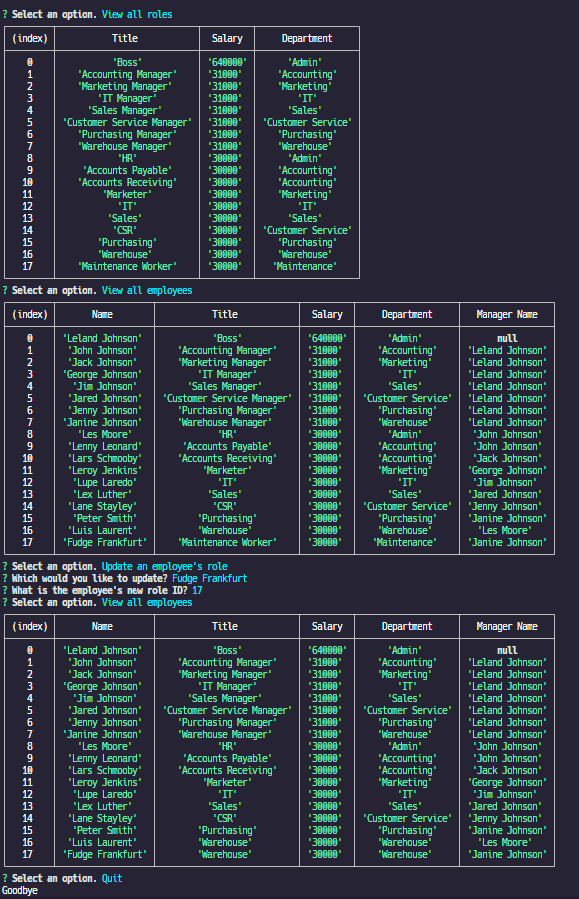

# Employee Tracker

## Description

This application uses a database to keep track of departments, employees, roles, salaries, and managers within an organization.

## Video

[Link](https://watch.screencastify.com/v/KK4TnMa2Dw8wwqvxugHa)

## Screenshot

## Table of Contents

- [Installation](#installation)
- [Usage](#usage)
- [Credits](#credits)
- [MIT license License](#license)

  

## Installation

This application is made to run in node. Download the application and install the dependencies before initializing. YOU MUST HAVE MYSQL INSTALLED AND USE THE CORRECT .ENV FILE TO RUN THE APPLICATION.

## Usage

You must initialize the database in mysql with './db/schema.sql'. You may also want to seed the database with './db/seeds.sql'. Once initialized simply enter 'node index' from the root directory.

## Questions

If you have any questions about this application send me an email or message on github.

My email address is: [lelandoj@gmail.com](mailto:lelandoj@gmail.com)

My repo URL is: [https://github.com/eljayman](https://github.com/eljayman)

## How to Contribute

If you would like to contribute to this, please send me a message on github.

## Tests

If you find any errors with this application please send me a message on github.

## Credits

This application was made to run in [node.js](https://nodejs.org/) and used [inquirer 8.2.4](https://github.com/SBoudrias/Inquirer.js#readme) as a dependency to create the prompts

## License

    Copyright 2022 eljayman

Permission is hereby granted, free of charge, to any person obtaining a copy of this software and associated documentation files (the "Software"), to deal in the Software without restriction, including without limitation the rights to use, copy, modify, merge, publish, distribute, sublicense, and/or sell copies of the Software, and to permit persons to whom the Software is furnished to do so, subject to the following conditions:

The above copyright notice and this permission notice shall be included in all copies or substantial portions of the Software.

THE SOFTWARE IS PROVIDED "AS IS", WITHOUT WARRANTY OF ANY KIND, EXPRESS OR IMPLIED, INCLUDING BUT NOT LIMITED TO THE WARRANTIES OF MERCHANTABILITY, FITNESS FOR A PARTICULAR PURPOSE AND NONINFRINGEMENT. IN NO EVENT SHALL THE AUTHORS OR COPYRIGHT HOLDERS BE LIABLE FOR ANY CLAIM, DAMAGES OR OTHER LIABILITY, WHETHER IN AN ACTION OF CONTRACT, TORT OR OTHERWISE, ARISING FROM, OUT OF OR IN CONNECTION WITH THE SOFTWARE OR THE USE OR OTHER DEALINGS IN THE SOFTWARE.
